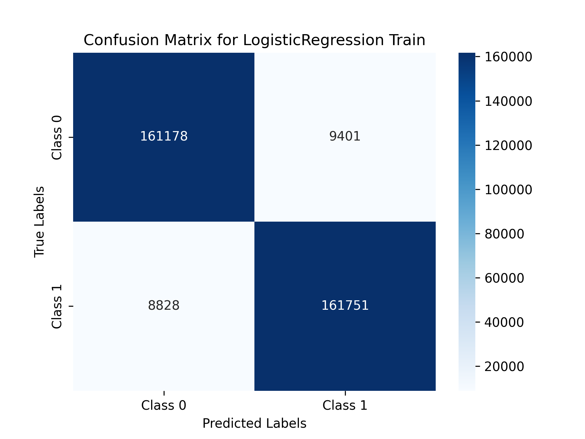
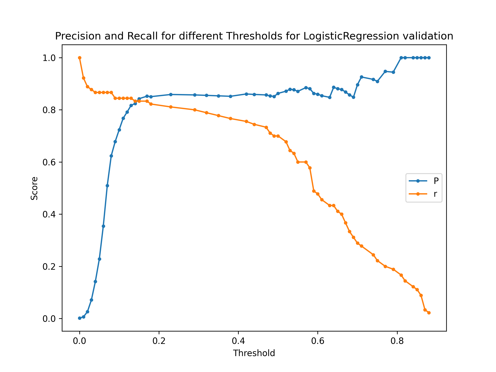

# 🧠 Machine Learning Model Evaluation Toolkit

This project provides a **comprehensive evaluation pipeline** for binary classification models. It offers precision-recall, ROC curves, optimal threshold detection, confusion matrix heatmaps, and more — making it easier to understand how your model performs beyond accuracy.

## 📂 Project Structure

```
.
├── prepare_data.py               # Preprocessing and data loading
├── data_saver.py                 # Utility to save evaluation images
├── eval.py                       # All evaluation functions
├── models/                       # (Optional) Folder to store trained models
├── results/                      # Saved visual outputs from evaluations
└── README.md                     # You're reading it!
```

## 🚀 Features

- Evaluate model with:
  - Default threshold (0.5)
  - **Optimal threshold** based on F1-score
- Confusion matrix + classification report
- **Precision-Recall Curve** with AUC
- **ROC Curve** with AUC
- Precision/Recall vs. Threshold visualization
- Easily pluggable with any `sklearn`-style model

## 🛠️ Setup

Install dependencies:

```bash
pip install numpy pandas matplotlib seaborn scikit-learn
```

## 📊 How to Use

1. **Train a Model**
```python
from sklearn.linear_model import LogisticRegression
model = LogisticRegression()
model.fit(X_train, y_train)
```

2. **Evaluate on Validation or Test Set**
```python
from eval import eval_valdtion

metrics, pr_auc, roc_auc = eval_valdtion(
    model_b=model,
    x_val=X_val,
    y_val=y_val,
    models_dict_compare={},
    model_name="LogReg",
    dataset_title=" Validation"
)
```

> Images will be automatically saved using `save_img()` from `data_saver.py`

## 🖼️ Example Outputs

- **Confusion Matrix**



- **Precision-Recall Curve**



- **ROC Curve**

_Curve_for_LogisticRegression_validation.png)

